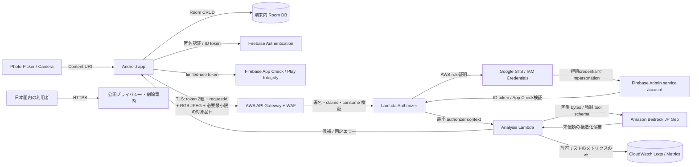

# 脅威モデル・データフロー・独立セキュリティレビュー

## 1. 適用範囲と判定

本書は Issue #38 の成果物として、`docs/requirements.md` を正本に、Android 端末から Firebase、AWS、Amazon Bedrock、CloudWatch ログ、公開ページまでの信頼境界を評価する。評価対象は dev 統合ブランチの基準コミット `40c4f9602a03b26a315b853b6d813091f3819855` と、独立レビューで追加した撮影画像 cleanup 修正 `dd8f66252d70feec1e11d6ace8e2936ffad42ef3` である。

評価尺度は次のとおりとする。

| 重大度 | 判断基準 |
| --- | --- |
| 重大 | 広範な秘密漏えい、任意コード実行、認証なしの無制限な AI 利用、または回復困難な大規模侵害 |
| 高 | 画像・認証情報・在庫データの漏えい、認証回避、費用上限の実効的な回避 |
| 中 | 前提条件が限定されたプライバシー・可用性・完全性への影響 |
| 低 | 影響または実現可能性が小さく、通常運用で回復可能 |

前回レビューで検出した API Gateway の Firebase authorizer import 不備と、一時画像削除失敗の再試行保証不足は PR #89/#92 相当の実装と構造・単体テストで解消した。再レビューでは撮影用一時画像だけが再試行対象外である高リスクを追加検出し、`dd8f662` で同じ永続削除レジストリ、起動・再開・定期再試行、集計値のみの監視へ統合した。未実施の dev 実環境デプロイと E2E は #95 の公開停止条件として追跡し、本レビューのコード・設計上の承認と分離する。

## 2. 資産とデータ分類

| 資産 | 分類 | 保存場所・保持 |
| --- | --- | --- |
| 食材名、数量、単位 | 利用者データ | アプリ専用 Room DB のみ。クラウド保存なし、バックアップ・端末移行から除外 |
| 原画像、正規化画像 | 個人に関する情報を含み得る機微データ | 原画像は選択元、正規化画像はアプリ cache の一時ファイル。AWS ではメモリ上だけ、永続保存なし |
| Firebase 匿名 UID | 仮名識別子 | Firebase Authentication。API 内では SHA-256 ハッシュ化してクォータ・冪等性キーに使用 |
| Firebase ID token / App Check token | 認証秘密 | 呼出し直前に取得し単一送信へ渡す。アプリ、API、監査ログに保存しない |
| AWS / Google の資格情報 | 高機密 | アプリへ搭載せず、Lambda 実行ロールと Google Workload Identity Federation の短期資格情報を使用 |
| AI 候補 | 信頼できない入力 | API 応答として端末へ返す。ユーザー確定前に Room へ反映せず、クラウド保存なし |
| 運用ログ・メトリクス | 運用データ | 許可リスト項目のみ。KMS 暗号化、dev 14日・stg 30日・prod 90日 |
| 公開プライバシー文書・削除案内 | 公開情報 | Issue #42 で公開・内容整合を確定し、Issue #40 の公開前提とする |

## 3. データフローと信頼境界

信頼境界は以下の6か所である。

1. **端末外入力境界**: Photo Picker、カメラ、Content URI、画像メタデータは信頼しない。
2. **端末永続化境界**: AI 候補と UI 入力は業務ルール検証とユーザー確定を経て Room に保存する。
3. **Firebase／Google WIF 境界**: Firebase SDK から得た匿名 UID と token は呼出しごとに検証する。Lambda Authorizer は AWS role 証明を Google STS／IAM Credentials へ交換し、許可された Firebase Admin service account の短期 credential だけを使用する。
4. **インターネット／AWS 境界**: API Gateway、WAF、Lambda Authorizer が公開 API と処理本体を分離する。
5. **AI provider 境界**: 画像と固定プロンプトを送信し、AI 出力を未信頼 JSON として再検証する。
6. **観測・公開境界**: ログは許可リスト、公開文書は実装との一致をリリース条件にする。

## 4. STRIDE 脅威と対策の追跡

| ID | 分類 | 脅威・影響 | 固有リスク | 対策と証跡 | 残存 |
| --- | --- | --- | --- | --- | --- |
| S-01 | Spoofing | 偽造 ID token で AI API を利用 | 重大 | #20。署名に加えて `aud`、`iss`、`exp`、`iat`、`auth_time` を検証し、失敗時 fail-closed。`infra/test/firebase-authorizer.test.ts` | 低 |
| S-02 | Spoofing | 非正規アプリ、App Check token 再利用 | 高 | #20/#22。Play Integrity の limited-use token、`appId`/audience/issuer/時刻と consume 結果を検証、authorizer cache 0。並行再利用テストあり | 低 |
| T-01 | Tampering | Content-Type 偽装、破損・巨大画像による解析回避／メモリ枯渇 | 高 | #19/#23。端末で magic bytes・宣言 MIME・20 MiB・40 MP・アニメーションを検査、サブサンプリング。API で JPEG magic bytes・実デコード・3 MiB・2048 px・4 MP を再検査。画像異常系テストあり | 低 |
| T-02 | Tampering | AI 出力に命令・未定義項目・範囲外値を混入 | 高 | #23/#25/#28/#33。tool を強制し、JSON Schema と provider 境界で最大30件・型・文字数・数量・単位・警告コードを検証。ユーザー確定前は保存しない | 低 |
| T-03 | Tampering | requestId 再利用による重複処理、別内容への差替え | 高 | #24/#35。UID ハッシュ＋requestId＋canonical request hash を DynamoDB で条件付き claim。重複・競合を拒否し TTL を設定。`infra/test/analysis-handler.test.ts`、`dynamo-idempotency-store.test.ts` | 低 |
| R-01 | Repudiation | 誰がどの障害・停止操作を起こしたか追跡不能 | 中 | #27/#29/#37。requestId、固定 outcome/error、AI停止の actor/reason を記録。画像・token・UIDは記録しない。`docs/runbooks/cloud-operations.md` の変更、復旧、rollback 手順 | 低 |
| I-01 | Information disclosure | EXIF、人物の映り込み、原画像の漏えい | 高 | #19/#21/#23/#25/#90。向きを画素反映後 RGB JPEG 再生成で EXIF 除去、送信物をプレビュー。Bedrock へ bytes で直接送信し S3・invoke logging・prompt 保存を使用しない。前処理・送信・撮影の一時ファイルは削除失敗を永続記録し、起動・再開・WorkManager で再試行する | 低 |
| I-02 | Information disclosure | token、UID、画像、候補、在庫、例外本文がログへ流出 | 高 | #20/#27。監査・telemetry は固定コードと許可リスト。UID はハッシュ化し、token 本文や例外を渡さない。`infra/test/analysis-telemetry.test.ts`、`firebase-authorizer.test.ts`、`analysis-handler.test.ts` | 低 |
| I-03 | Information disclosure | 端末在庫がクラウドバックアップや広範な写真権限から漏えい | 高 | #16/#18。Room はアプリ専用、`allowBackup=false` と DB/root の backup/device-transfer 除外。Photo Picker を使い `READ_MEDIA_IMAGES`/ストレージ権限なし、FileProvider 非公開。`ImageInputManifestTest.kt` | 低 |
| I-04 | Information disclosure | 秘密鍵・AWS credential をアプリ／リポジトリへ埋込み | 重大 | #11/#12/#20。Lambda role と Google WIF の短期資格情報、OIDC deploy、最小権限 IAM、gitleaks、Dependabot、lockfile。`google-wif-config.test.ts`、`foundation-stack.test.ts` | 低 |
| D-01 | Denial of service | 認証済み／未認証の大量リクエストで可用性・費用を消費 | 高 | #35/#37。WAF IP 10回/分、API burst 2/rate 10、利用者短期2・日5・月30、全体月8000、prod concurrency 5、Budget、異常検知、緊急停止。原子的予約・返却テストと Runbook drill | 低 |
| D-02 | Denial of service | Firebase・AWS・Bedrock 障害で在庫管理まで停止 | 高 | #13–#17/#26。手動 CRUD と Room を認証・AI 境界から分離。認証・解析失敗は分類して手動入力へ退避し、60秒で timeout | 低 |
| E-01 | Elevation of privilege | Lambda role や API Gateway invoke 権限の過大化 | 高 | #11/#20/#25。DynamoDB、Bedrock profile、destination model、LogGroup、API path ごとに action/resource/condition を限定。ワイルドカード IAM 検査あり | 低 |
| E-02 | Elevation of privilege | AI 文字列を命令・コード・権限判断として実行 | 重大 | #23/#25。AI は固定 schema のデータ候補のみを返し、自由文 warning を禁止。コード実行・IAM・制御経路へ接続せず、ユーザー確認が必須 | 低 |

## 5. 境界別の検証証跡

| 境界 | 自動検証 | 実装・運用証跡 |
| --- | --- | --- |
| 認証 | `infra/test/firebase-authorizer.test.ts`、`infra/test/analysis-api-stack.test.ts`、`app/src/test/.../AuthCoordinatorTest.kt`、`AuthCoordinatorFreshAuthorizationTest.kt` | #20/#22、`infra/lambda/firebase-authorizer.ts`、`docs/runbooks/cloud-operations.md` |
| 画像 | `ImageInputManifestTest.kt`、`ImageTemporaryFileCleanerTest.kt`、`ImageCleanupMonitoringTest.kt`、`CameraImageStoreTest.kt`、`ImageAnalysisSessionTest.kt`、`ImagePreprocessorTest.kt`、`infra/test/analysis-handler.test.ts` | #18/#19/#21/#23/#90、`ImagePreprocessor.kt`、`CameraImageStore.kt`、`ImageCleanupWorker.kt`、`analysis-handler.ts` |
| AI | `infra/test/nova-provider.test.ts`、`nova-bedrock-adapter.test.ts`、`provider-boundary.test.ts`、`bedrock-model-policy.test.ts` | #23/#25、`bedrock-model-policy.json`。JP Geo と account retention `none` を起動・deploy 時に fail-closed 検証 |
| 秘密・権限 | `google-wif-config.test.ts`、`foundation-stack.test.ts`、`analysis-api-stack.test.ts`、Security workflow の Secret scan / dependency audit / IaC scan | #11/#12/#20/#25、`.github/workflows/security.yml`、`.github/CI.md` |
| ログ | `analysis-telemetry.test.ts`、`firebase-authorizer.test.ts`、`analysis-handler.test.ts` | #27、KMS 暗号化 LogGroup、allowlist telemetry、環境別保持、CloudWatch alarm/dashboard |
| 公開ページ | Issue #42 の文面・Data safety 照合、Issue #40 の公開判定 | #42 完了前は公開不可。匿名アカウント該当性、App Check 使用済 token 最大30日、prod ログ90日を記載対象とする |

## 6. 手動レビュー結果

- Android manifest は `INTERNET` 以外の危険権限を宣言せず、Photo Picker に必要のない広範な写真権限を持たない。FileProvider は `exported=false` である。
- アプリの API endpoint は HTTPS のみを受理し、token の `toString` は redacted、SDK 例外・UID・token を logger へ渡さない。
- AWS API の設計は認証前に解析 Lambda へ到達させず、authorizer context を検証済みフラグと UID に限定し、処理側でも context を再確認する。
- OpenAPI import の custom authorizer 宣言と POST security 参照を CDK 生成物の構造テストで固定した。dev 実環境の未認証拒否は #95 で再確認し、成功するまで公開しない。
- API 応答は `cache-control: no-store` を付与し、provider の例外本文・stack trace を利用者へ返さない。
- 画像用 S3 bucket、Bedrock model invocation logging、prompt 保存の実装はない。release artifact 用 S3 は AI 画像経路とは別である。
- 前処理・送信・撮影の各一時画像は既知 prefix と canonical directory 境界を再検証して atomic quarantine 後に削除する。失敗は basename と初回失敗時刻だけを非公開レジストリへ記録し、画像名を含まない集計値だけを Crashlytics へ通知する。
- DynamoDB に保存するのは冪等性、クォータ、緊急停止の制御情報であり、画像・AI 候補・食材一覧を保存しない。
- CloudWatch telemetry は requestId を改行・長さ・文字種で正規化し、画像・候補・prompt・token・UID・在庫・例外本文を拒否する。
- GitHub Actions は固定 commit SHA の Action、`npm ci`、高・重大の依存／IaC検査、全履歴 secret scan を使用する。

## 7. 残存リスクと受容条件

| ID | 残存リスク | 重大度 | 所有・期限・受容条件 |
| --- | --- | --- | --- |
| RR-01 | 食材以外の人物・住所等が画像に映り、処理中は Firebase/AWS/Bedrock の委託先へ送信される | 中 | #42。送信前説明、送信先、目的、保持、削除、国外処理を公開文書へ明記。#40 の公開前に完了必須 |
| RR-02 | Firebase 匿名ユーザー削除と端末データ削除が部分失敗する | 中 | #41。復元不能確認、Room・一時データ・匿名ユーザー削除、部分失敗の安全な再試行を実装・試験 |
| RR-03 | 公開ページ／Data safety が実データフローと不一致になる | 中 | #42 を #38/#41 の後続にし、#40 は E8-3 完了を前提とするため、不一致のまま公開しない |
| RR-04 | 盗難・root 化された端末からアプリ専用 DB や処理中画像を取得される | 中 | OS sandbox、backup 無効、一時ファイル削除で低減。初期要件に端末 DB の追加暗号化はなく、端末侵害を前提とした完全保護は対象外 |
| RR-05 | Firebase API key の利用制限や実環境 WAF・通知購読など、クラウド外部設定がコードと乖離する | 中 | #29/#37/#40。deploy/smoke/drill とリリースチェックで実環境を照合し、未確認環境を公開しない |
| RR-06 | Bedrock 事業者側の保持条件・対応モデル条件が後日変更される | 中 | #25。90日で失効する公式証跡、deploy/synth と起動時の `data_retention_mode: none` 検査。確認不能なら AI 呼出しを停止 |
| RR-07 | 2026-07-26 公開の `brace-expansion` DoS advisory（GHSA-3jxr-9vmj-r5cp / GHSA-mh99-v99m-4gvg）が、最新 `aws-cdk-lib` の bundled dependency を含む build/test toolchain に残る | 低（advisory 表示は High） | CDK/Jest/ESLint は CI・deploy の信頼済みリポジトリ入力だけを処理し、公開 API の実行 artifact からは到達しない。`npm audit --audit-level=high --ignore-scripts` を必須ゲートのまま維持して新規統合を停止し、上流の修正版公開後に lockfile を更新する。閾値緩和、lockfile 偽装、破壊的な `--force` は行わない |
| RR-08 | OpenAPI import と実環境 API Gateway の authorizer 設定が乖離する | 低 | PR #89。`x-amazon-apigateway-authtype: custom` と POST security 参照を構造テストで固定済み。#95 の dev 未認証 negative smoke が成功するまで公開停止 |
| RR-09 | OS・ストレージ障害により一時画像が削除期限を超過する | 低 | #90。削除失敗検知、プロセス再起動を跨ぐ自動再試行、canonical 境界、期限超過監視を実装・試験済み。残件・監視失敗は Worker retry と Crashlytics 集計通知で運用検知する |

Issue #7 配下の AI 品質評価は保留中だが、これは認識精度の採用判断であり、本レビューの認証・画像保持・入力検証・権限・ログ統制を無効化しない。品質未確定の AI 候補は自動確定せず、ユーザーが修正・確定するため、セキュリティ上は未信頼入力として処理される。

## 8. 独立レビュー承認

実装担当とは分離した security-reviewer 観点で、認証、画像、AI、秘密、ログの5境界を STRIDE により再評価した。

- 重大・高リスクは、予防統制と自動検知／停止のいずれか一方だけでなく、原則として多層化されている。
- 重大・高の対策は、閉じた Issue #11/#12/#18–#25/#27/#35、実装、自動テスト、または `docs/runbooks/cloud-operations.md` へ追跡できる。
- 残存リスクは中以下で、#29/#37/#40/#41/#42 の完了または公開停止という受容条件を持つ。
- `npm audit` が報告する High advisory は RR-07 のとおり build/test toolchain に限定され、実行時データフローへの到達経路がない。安全側に CI を fail-closed とし、上流修正版が出るまで統合しないため、未対策の製品 High リスクとは判定しない。
- 前回の高リスク2件と、再レビューで検出した撮影画像 cleanup の高リスクは、予防統制・自動再試行・自動試験へ反映済みである。
- よって、評価対象コミットは Issue #38 の受け入れ条件「高・重大リスクに未対策がない」を満たすと承認する。dev 実環境の未認証拒否、App Check、画像解析 E2E は #95 の受け入れ条件であり、未成功のまま prod 公開しない。

## 9. 検証記録

2026-07-28 に dev 統合 worktree、Issue #90 worktree、Issue #38 worktree で以下を再検証した。

| コマンド | 結果 |
| --- | --- |
| `npm ci --ignore-scripts` | 成功 |
| `npm test -- --runInBand`（dev 統合ブランチ） | 16 suites / 159 tests 成功 |
| `npm run lint && npm run build && npm run synth`（dev 統合ブランチ） | lint、TypeScript compile、dev・stg・prod CloudFormation synth 成功 |
| `./gradlew testDebugUnitTest lintDebug`（dev 統合ブランチ） | 成功 |
| `./gradlew assembleDebug assembleDebugAndroidTest`（dev 統合ブランチ） | 成功 |
| `./gradlew testDebugUnitTest --tests com.quotto.fridgemanager.image.ImageTemporaryFileCleanerTest --tests com.quotto.fridgemanager.image.ImageCleanupMonitoringTest --rerun-tasks`（`dd8f662`） | 22 tests 成功。撮影画像の削除失敗→永続記録→再起動相当の再試行を含む |
| `./gradlew assembleDebugAndroidTest`（`dd8f662`） | 成功。既存 `CameraImageStoreTest` を含む instrumentation APK のコンパイル成功 |
| `git diff --check` | 成功 |
| `npm audit --audit-level=high --ignore-scripts` | **失敗（意図した fail-closed）**。critical 0、High 1。根は `aws-cdk-lib` 同梱の `brace-expansion <=5.0.7` で、RR-07/#88 として評価 |

`npm audit fix --ignore-scripts` で非破壊的に更新できる範囲も調査したが、根本原因である `aws-cdk-lib` の bundled dependency は置換されないため、部分的な lockfile 更新は本 Issue に含めず #88 で一括追跡する。`--force`、監査閾値の緩和、lockfile の手修正は行っていない。

ローカル環境には `gitleaks` と `trivy` がないため、全履歴 secret scan と synth 済み IaC の High/Critical scan は `.github/workflows/security.yml` の GitHub Actions 証跡を正とする。これらの必須チェックを通過しない変更は統合しない。
